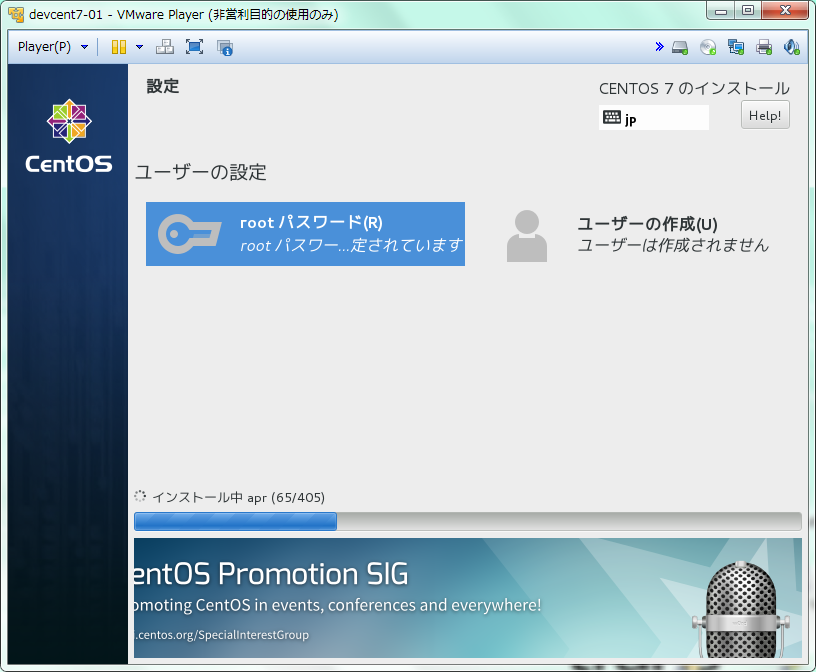
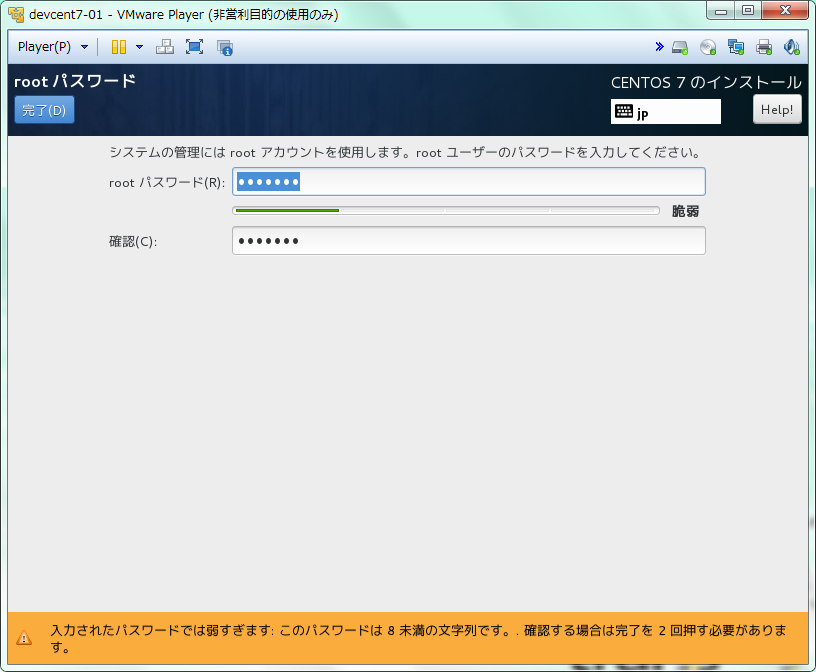
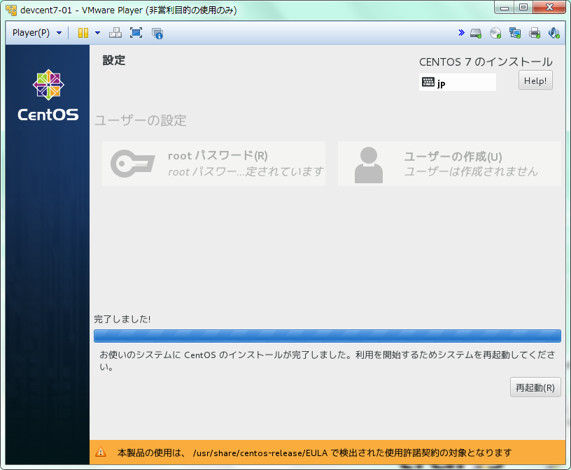

# インストール
インストールの概要ページにある各項目を設定すると「インストールの開始」を選択できるようになります。  
インストールを進めると困る場合はここで各設定を改めて確認しておきます。  

  

インストールを開始するとインストールウィザードが開始され、  
合わせてOSユーザーのパスワード設定を行う画面となります。  

  

ここでrootユーザーのパスワードを設定しておきます。  

  

パッケージのインストールが完了すると再起動を促されますので、  
再起動してインストールは完了となります。  

  

インストール関連のログは下記に出力されるため、必要により退避させておく。  

| logfile            | value                                         |
| ------------------ | --------------------------------------------- |
| /tmp/anaconda.log  | Anaconda の全般メッセージ                      |
| /tmp/program.log   | インストール中に実行された全外部プログラム        |
| /tmp/storage.log   | ストレージモジュールの詳細情報                   |
| /tmp/packaging.log | yum および rpm パッケージのインストールメッセージ |
| /tmp/syslog        | ハードウェア関連のシステムメッセージ              |
